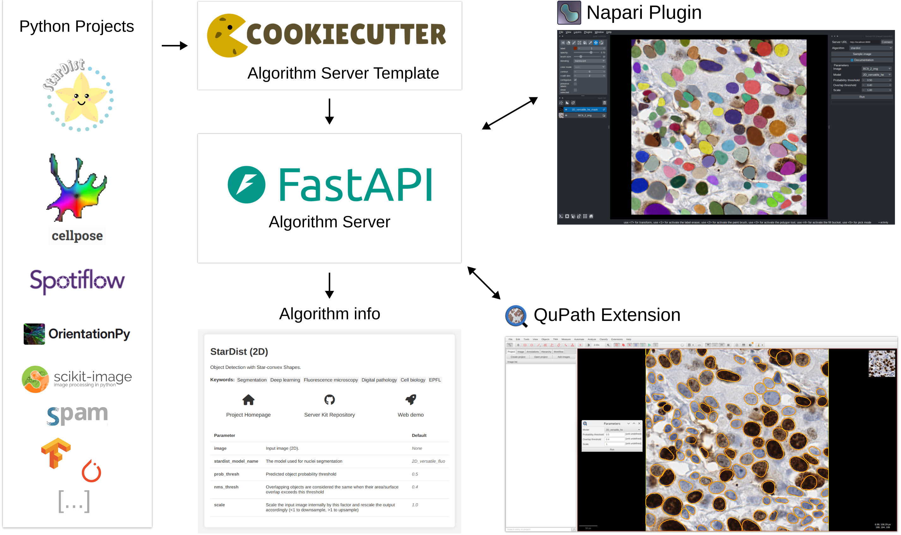

# 👋 Welcome!

The **Imaging Server Kit** is an initiative started by the [EPFL Center for Imaging](https://imaging.epfl.ch/) to develop a simple framework for creating and using interoperable image processing algorithms via a client/server system.

The *kit* includes:

- A **collection of algorithms** that can be deployed as web servers (with or without [Docker](https://github.com/Imaging-Server-Kit/serverkit-deploy-docker)) and run from [QuPath](https://github.com/Imaging-Server-Kit/qupath-extension-serverkit) or [Napari](https://github.com/Imaging-Server-Kit/napari-serverkit), for a wide range of tasks:
 
| Task              | Examples                        | Napari | QuPath |
|-------------------|---------------------------------| ------ | ------ |
| Segmentation     | [StarDist](https://github.com/Imaging-Server-Kit/serverkit-stardist), [CellPose](https://github.com/Imaging-Server-Kit/serverkit-cellpose), [Rembg](https://github.com/Imaging-Server-Kit/serverkit-rembg), [SAM-2](https://github.com/Imaging-Server-Kit/serverkit-sam2), [InstanSeg](https://github.com/Imaging-Server-Kit/serverkit-instanseg)               | ✅ | ✅ |
| Object detection | [Spotiflow](https://github.com/Imaging-Server-Kit/serverkit-spotiflow), [LoG detector](https://github.com/Imaging-Server-Kit/serverkit-skimage-LoG)    | ✅ | ✅ |
| Vector fields   | [Orientationpy](https://github.com/Imaging-Server-Kit/serverkit-orientationpy)                   | ✅ | ✅ |
| Object tracking  | [Trackastra](https://github.com/Imaging-Server-Kit/serverkit-trackastra), [Trackpy](https://github.com/Imaging-Server-Kit/serverkit-trackpy)         | ✅ |  |
| Image-to-Image  | [SPAM](https://github.com/Imaging-Server-Kit/serverkit-spam), [Noise2Void](https://github.com/Imaging-Server-Kit/serverkit-n2v)         | ✅ |  |
| Text-to-Image   | [Stable Diffusion](https://github.com/Imaging-Server-Kit/serverkit-stable-diffusion)         | ✅ |  |
| Image-to-Text   | [Image captioning](https://github.com/Imaging-Server-Kit/serverkit-blip-captioning)         | ✅ |  |
| Classification   | [ResNet50](https://github.com/Imaging-Server-Kit/serverkit-resnet50)         | ✅ |  |

- A [Template](https://github.com/Imaging-Server-Kit/cookiecutter-serverkit) to easily create new image processing algorithm servers.

The *Imaging Server Kit* is designed for:

- **Algorithm developers**: Test your tools in QuPath or Napari without having to create extensions or plugins.
- **Non-technical Users**: Use Python projects without needing to set them up on your computer.

### Key Features

- **Server/Client**: Run algorithms on a server that you connect to from client apps (Napari, QuPath).
- **Auto-generated UI** for algorithm parameters in QuPath and Napari. No need for separate extensions or plugins!
- **Interoperable Algorithms** that all accept inputs and express outputs in the same way.
- **Dockerized**: Build or pull a Docker image, then start/stop a container to use an algorithm.

## Roadmap

**March 2025**

The *Imaging Server Kit* is under construction! Here is what we're up to:

- [X] Make the `/info` route look nice
- [ ] Screencast a tutorial on how to create a new algorithm server
- [ ] Add a server-side timeout to the `/process` endpoint
- [ ] Improve the AuthenticatedServer
- [ ] Handle streaming/tiling for processing whole-slide images
- [ ] Add a sample image button in the QuPath extension
- [ ] QuPath extension can send annotations as algo inputs
- [ ] Make a Fiji plugin

## Contributors

- Mallory Wittwer, EPFL Center for Imaging (mallory.wittwer@epfl.ch)
- Edward Andò, EPFL Center for Imaging
- Maud Barthélémy, EPFL Center for Imaging
- Florian Aymanns, EPFL Center for Imaging

## Acknowledgements

We acknowledge the [Personalized Health and Related Technologies (PHRT)](https://www.sfa-phrt.ch/) initiative for supporting this project.