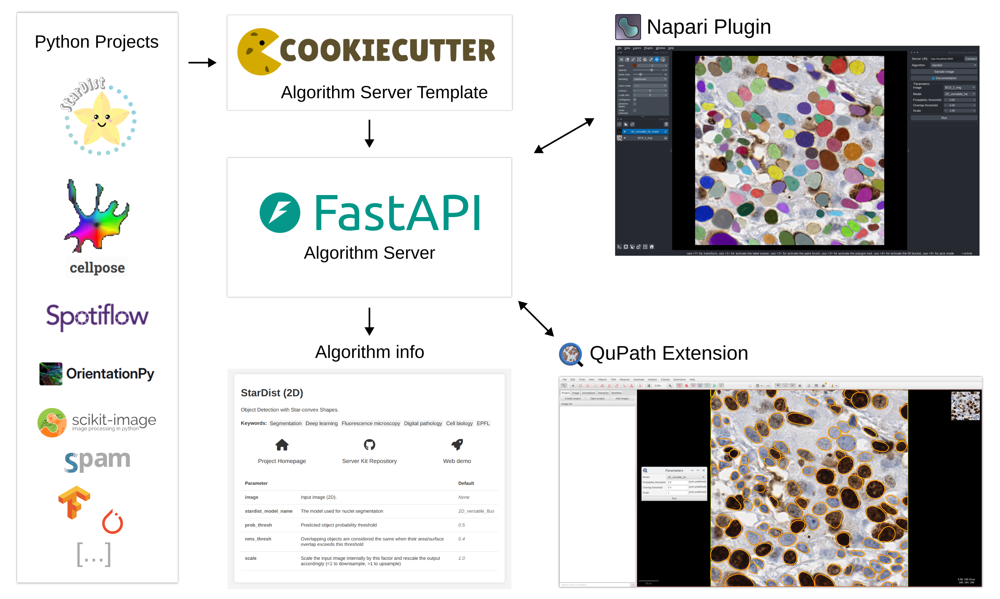

# 👋 Welcome!

The **Imaging Server Kit** is an initiative started by the [EPFL Center for Imaging](https://imaging.epfl.ch/) to develop a simple framework for creating and using interoperable image processing algorithms via a client/server system.

The *kit* includes:

- A **collection of algorithms** that can be deployed as web servers (with or without [Docker](https://github.com/Imaging-Server-Kit/serverkit-deploy-docker)) and run from [QuPath](https://github.com/Imaging-Server-Kit/qupath-extension-serverkit), [Napari](https://github.com/Imaging-Server-Kit/napari-serverkit), or a web browser: 
  - [StarDist](https://github.com/Imaging-Server-Kit/serverkit-stardist): Object detection with star-convex shapes
  - [CellPose](https://github.com/Imaging-Server-Kit/serverkit-cellpose): A generalist algorithm for cellular segmentation
  - [Spotiflow](https://github.com/Imaging-Server-Kit/serverkit-spotiflow): Accurate and efficient spot detection
  - [Rembg](https://github.com/Imaging-Server-Kit/serverkit-rembg): A tool to remove images background
  - [LoG detector](https://github.com/Imaging-Server-Kit/serverkit-skimage-LoG): Laplacian of Gaussian filter
  - [Orientationpy](https://github.com/Imaging-Server-Kit/serverkit-orientationpy): Measurement of greyscale orientations
  - ➡️ Many more to come

- A [Template](https://github.com/Imaging-Server-Kit/cookiecutter-serverkit) to easily create new image processing algorithm servers. A wide range of tasks can be *serverized*:

| Task              | Output       | Examples                        |
|-------------------|------------------------|---------------------------------|
| Segmentation      | Segmentation masks     | StarDist, CellPose, Rembg              |
| Object detection  | Bounding boxes, Points | Spotiflow, LoG detector    |
| Vector fields     | Vector fields          | Orientationpy                   |
| Image filtering   | Images                 | Registration, Denoising         |
| Object tracking   | Tracking data          | Trackpy         |

The *Imaging Server Kit* is designed for:

- **Algorithm developers**: Test your tools in QuPath or Napari without having to create extensions or plugins.
- **Non-technical Users**: Use Python projects without needing to set them up on your computer.

### Key Benefits

- **Algorithm Interoperability**: Easily compare algorithm outputs or integrate multiple algorithms to build complex workflows.
- **Containerization**: Deploy algorithms in Docker containers to eliminate dependency conflicts and ensure reproducibility.
- **Powerful Processing**: Run servers on powerful workstations (e.g., with GPU) and connect via client apps on a laptop.
- **Easy Collaboration**: Provide collaborators with a server URL and let them try your algorithm.
- **User-Friendly Interfaces** automatically generated for algorithm parameters in QuPath and Napari.
- **Effortless Deployment**: Pull a Docker image, then simply start/stop a container to use an algorithm.

## Roadmap

**January 2025**

The *Imaging Server Kit* is under construction! Here is what we're up to:

- [x] Add styling to the algorithm `/info` page
- [ ] Screencast a tutorial on how to create a new algorithm server
- [ ] Add a `class` output type to support image classifiers
- [ ] Add a timeout to the `/process` endpoint
- [ ] Add a sample image button in the QuPath extension
- [ ] QuPath extension can send annotations as algo inputs
- [ ] Make a Fiji plugin

## Contributors

- Mallory Wittwer, EPFL Center for Imaging (mallory.wittwer@epfl.ch)
- Edward Andò, EPFL Center for Imaging
- Maud Barthélémy, EPFL Center for Imaging

## Acknowledgements

We acknowledge the [Personalized Health and Related Technologies (PHRT)](https://www.sfa-phrt.ch/) initiative for supporting this project.